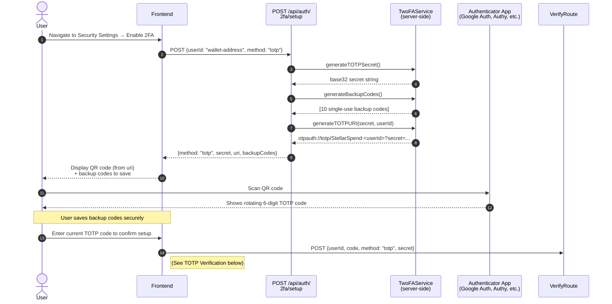
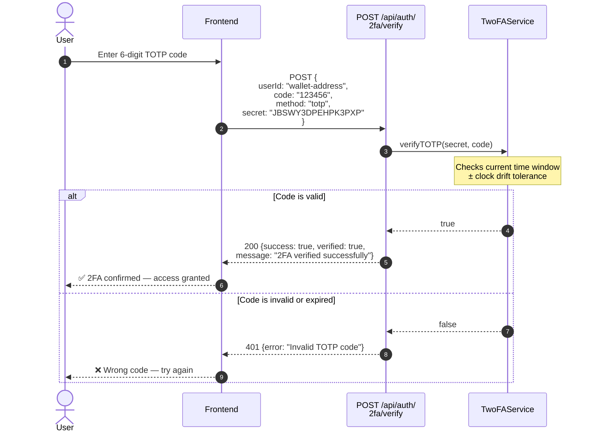
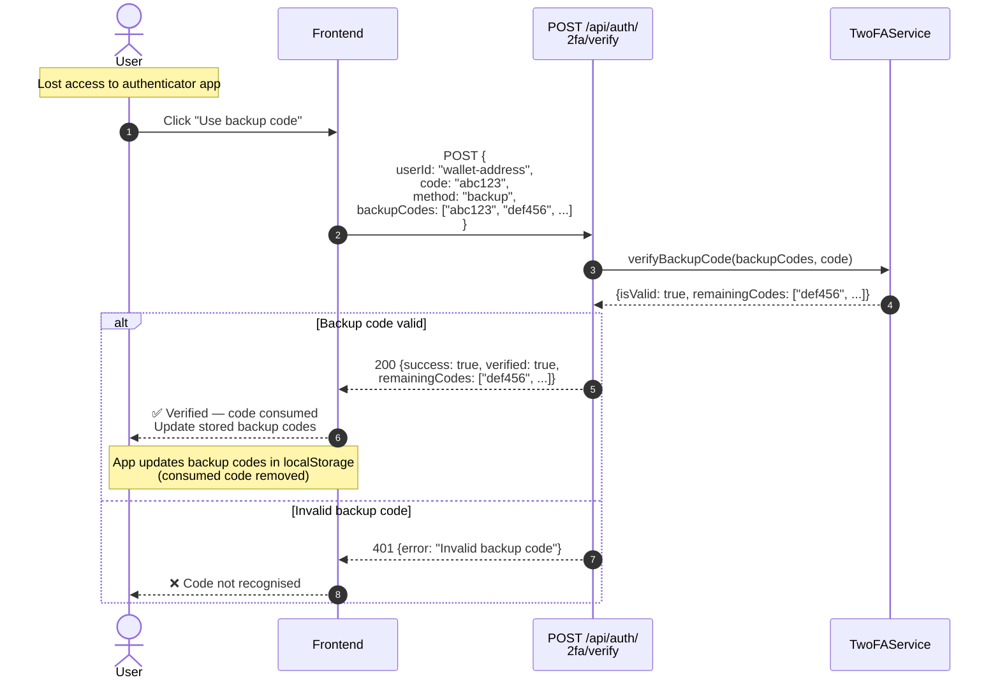
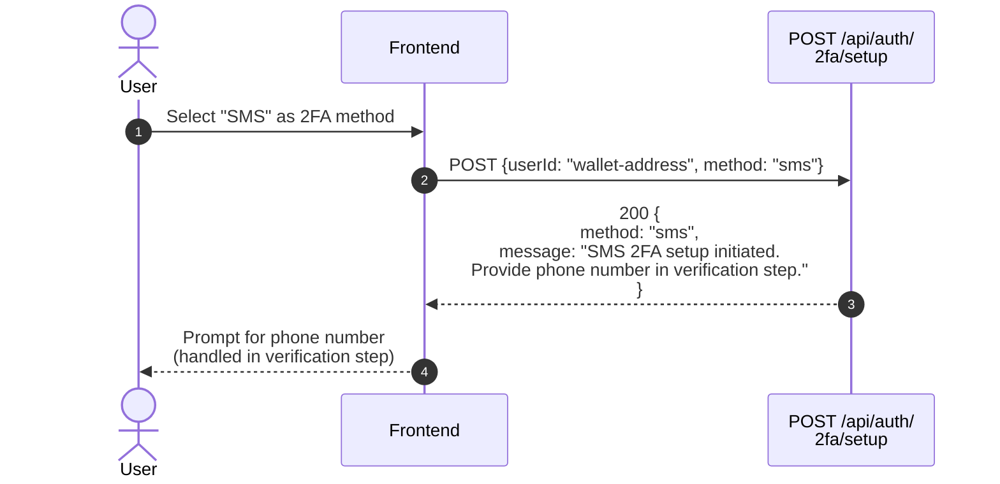

# Sequence Diagram: 2FA Setup and Verification

This diagram shows the two-factor authentication flows — TOTP setup and verification,
backup code generation, and SMS 2FA initiation.

## TOTP Setup Flow

## TOTP Verification Flow

## Backup Code Verification Flow

## SMS 2FA Setup Flow

## Notes

- **Secret storage:** The TOTP `secret` is generated server-side and returned to the client **once**.  
  The client is responsible for storing it (e.g., in localStorage) and passing it back with each verify request.  
  The server does **not** persist the secret in a database.
- **Backup codes:** Each code is single-use. After successful verification, the `remainingCodes` array  
  (with the used code removed) must be saved by the client.
- **Clock drift:** TOTP is time-based (RFC 6238). `TwoFAService.verifyTOTP` accepts a tolerance  
  window to account for clock skew between the server and the authenticator app.
- **SMS 2FA:** Full SMS delivery is not implemented in the current server — the setup route initiates  
  the flow and defers phone number collection to the verification step.
