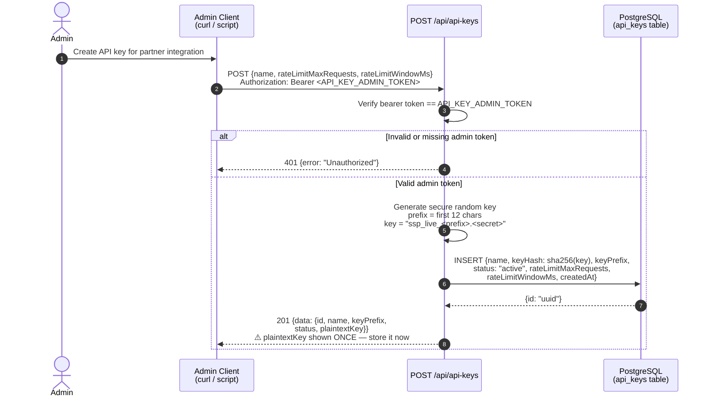
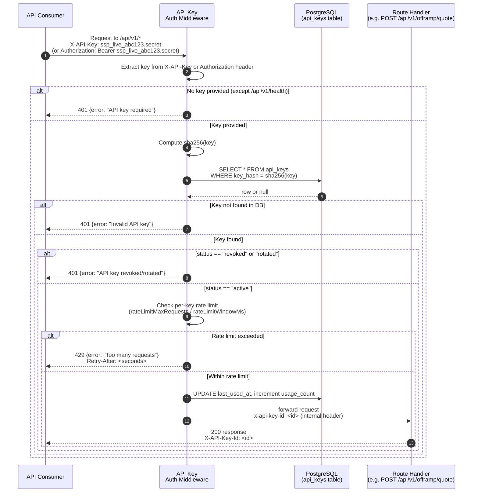
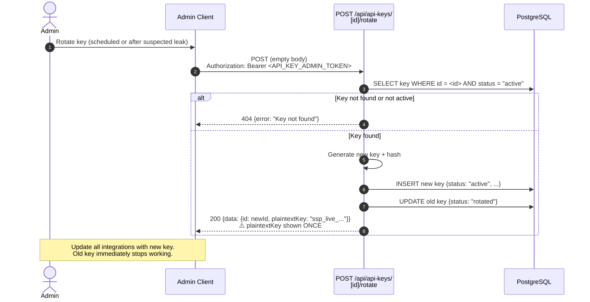
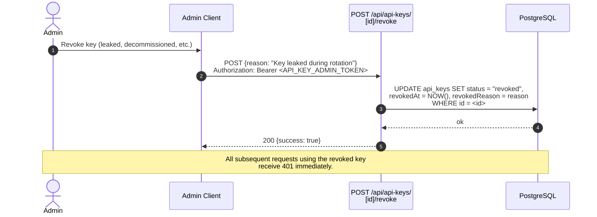

# Sequence Diagram: API Key Authentication Flow

This diagram shows the full lifecycle of programmatic API keys — creation by an admin,
authentication on protected routes, rotation, and revocation.

## API Key Creation (Admin)

## API Key Authentication on Protected Route

## API Key Rotation

## API Key Revocation

## Notes

- **One-time plaintext:** The `plaintextKey` is returned only at creation and rotation time.  
  It is **never stored** — only the `sha256` hash lives in the database. If lost, rotate the key.
- **Key prefix:** The `keyPrefix` (first 12 characters) is stored in plaintext for identification  
  in logs and the admin UI without exposing the full secret.
- **Public route exception:** `GET /api/v1/health` is publicly accessible without an API key.
- **Rate limits:** Each key has its own `rateLimitMaxRequests` and `rateLimitWindowMs`.  
  Global IP-based rate limits still apply on top of per-key limits.
- **Usage tracking:** Every authenticated request updates `last_used_at` and is recorded in the  
  usage log (accessible via `GET /api/api-keys/[id]/usage`).
