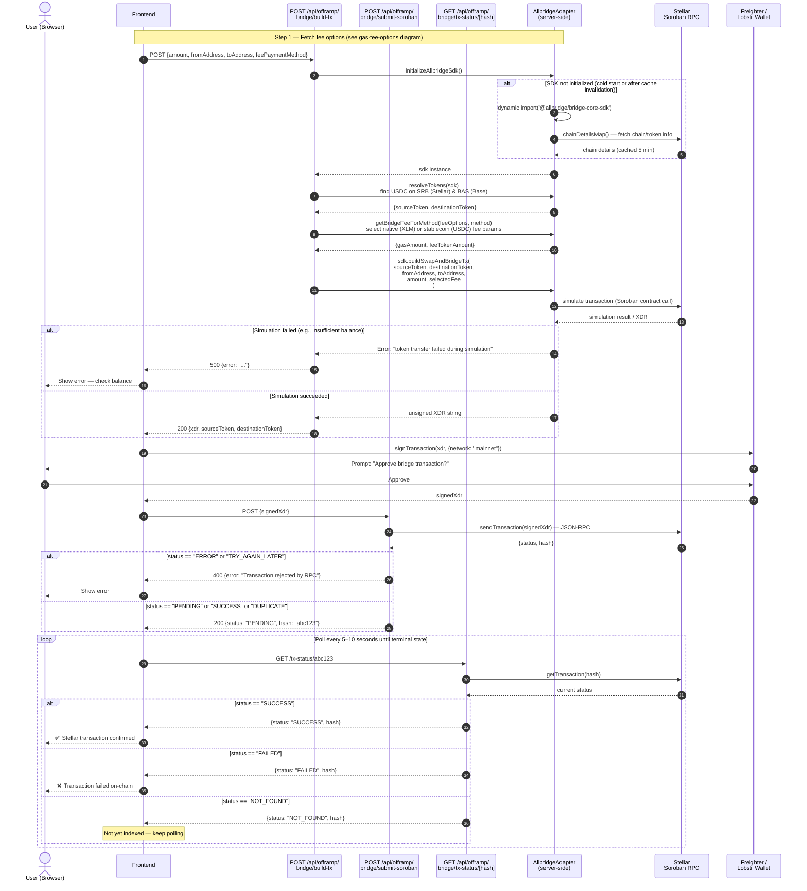

# Sequence Diagram: Bridge Transaction Building (Stellar → Base)

This diagram shows the detailed flow of building, signing, and submitting a
Soroban XDR transaction that bridges USDC from Stellar to Base via Allbridge.

## Notes

- **Fee methods:** `stablecoin` (USDC fee, no extra XLM needed) is the default and safest option.  
  `native` (XLM fee) can fail if the account is near the Stellar minimum reserve.
- **SDK singleton:** The `AllbridgeAdapter` maintains a module-level SDK instance and a 5-minute TTL  
  cache for chain details. Only the first request after a cold start pays the initialization cost.
- **Duplicate submissions:** If `submit-soroban` returns `DUPLICATE`, the transaction was already  
  submitted. Treat it as `PENDING` and poll `tx-status` with the existing hash.
- **Diagnostic events:** On `ERROR` status from Soroban RPC, diagnostic events are logged server-side.  
  Check server logs for `Diagnostic events:` entries when debugging.
