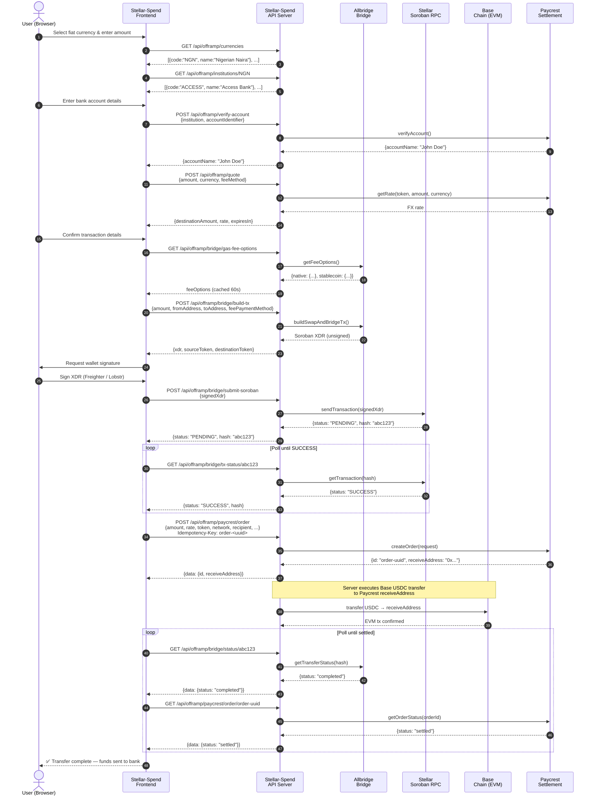

# Sequence Diagram: Complete Off-Ramp Flow (Stellar → Bank)

This diagram shows the full end-to-end flow of converting Stellar USDC to fiat currency
and delivering it to a beneficiary bank account.

## Notes

- **Step 14 (sign XDR):** The private key never leaves the user's wallet. The server only sees the signed XDR.
- **Idempotency:** The Paycrest order creation at step 20 uses an `Idempotency-Key` so safe retries on network failure won't create duplicate orders.
- **Terminal states for polling:**
  - Bridge: `completed`, `failed`, `expired`
  - Paycrest order: `settled`, `refunded`, `expired`
- **Recommended polling interval:** 5–10 seconds.
- The `receiveAddress` from step 20 is the Paycrest deposit address on Base. The bridge delivers USDC there automatically once the Stellar transaction confirms.
