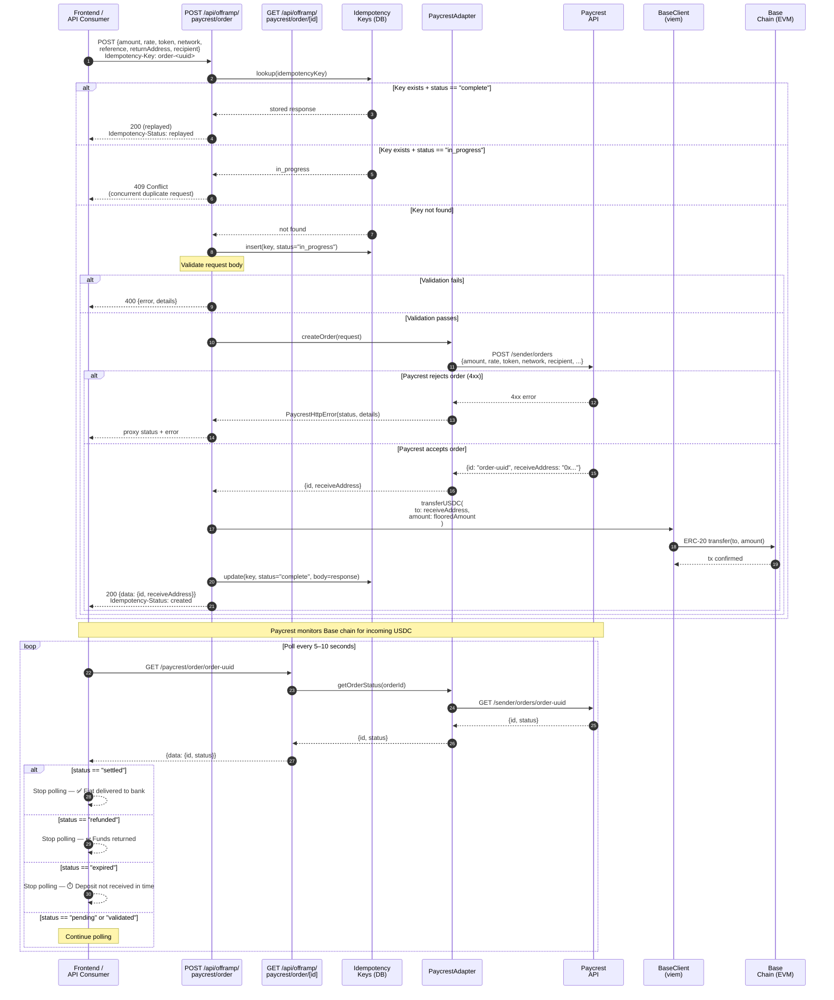

# Sequence Diagram: Paycrest Order Creation and Polling

This diagram shows the lifecycle of a Paycrest fiat payout order — from creation through
settlement (or failure), including webhook notifications.



## Order Status Lifecycle

```
pending → validated → settled    ✅  (success path)
pending → validated → refunded   ↩️  (funds returned to returnAddress)
pending → expired                ⏱️  (deposit not received within timeout)
```

## Notes

- **Idempotency:** The `Idempotency-Key` header protects against double-creates on network retry.  
  Use a stable key per logical operation (e.g., `order-<walletAddress>-<referenceId>`).
- **Amount flooring:** The `amount` passed to Paycrest is **floored** to 6 decimal places —  
  never rounded up — to ensure the deposit is never short.
- **Rate locking:** The `rate` is locked at quote time. If the FX rate changes significantly before  
  the order is submitted, Paycrest may reject it.
- **Base USDC transfer:** The server holds a `BASE_PRIVATE_KEY` that controls the treasury wallet.  
  The `receiveAddress` returned by Paycrest is valid only for the specific order; reusing it for  
  another order will not credit the second order.
- **Webhook alternative to polling:** See [`webhook-handling.md`](./webhook-handling.md) for  
  event-driven order status updates instead of polling.
