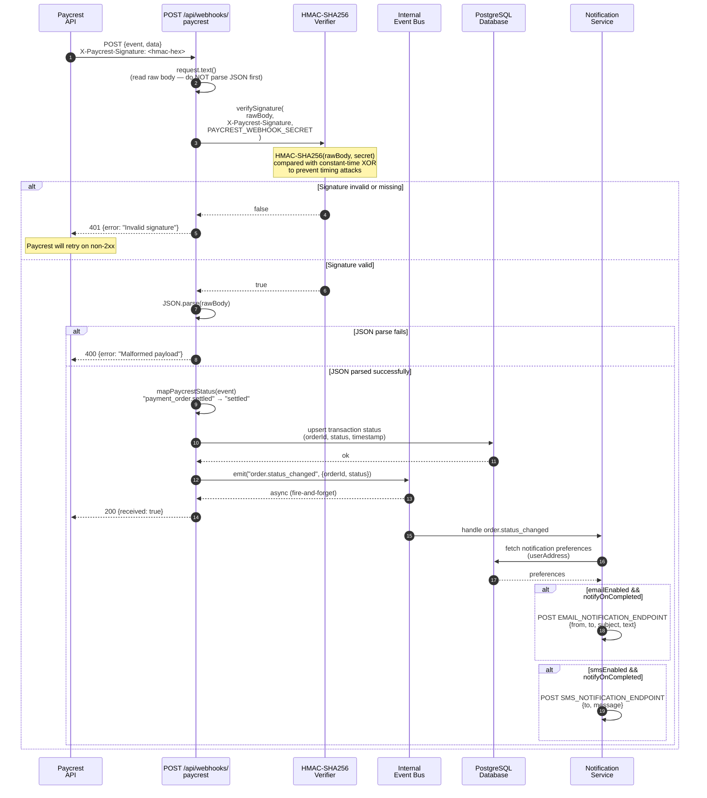

# Sequence Diagram: Webhook Handling (Paycrest Events)

This diagram shows how Paycrest payment event webhooks are received, verified,
and processed by Stellar-Spend.



## Event → Internal Status Mapping

| Webhook Event | Internal `PayoutStatus` | Terminal? |
|---|---|---|
| `payment_order.pending` | `pending` | No |
| `payment_order.validated` | `validated` | No |
| `payment_order.settled` | `settled` | ✅ Yes |
| `payment_order.refunded` | `refunded` | ✅ Yes |
| `payment_order.expired` | `expired` | ✅ Yes |

Unknown events default to `pending`.

## Retry Behaviour

Paycrest retries webhook delivery on non-`2xx` responses. The handler always returns `200 {received: true}` after successful signature verification, even if the downstream event handling fails asynchronously. This prevents Paycrest from retrying for errors the app cannot recover from.

## Webhook Registration

In the Paycrest dashboard, set the webhook URL to:

```
https://<your-domain>/api/webhooks/paycrest
```

Both `/api/webhooks/paycrest` (legacy) and `/api/v1/webhooks/paycrest` (versioned) accept events.

## Security Notes

- The raw request body is read **before** any JSON parsing. Parsing can change byte sequences (e.g., whitespace normalisation) which would invalidate the HMAC comparison.
- Signature comparison uses a constant-time XOR loop — not `===` — to prevent timing side-channel attacks.
- `PAYCREST_WEBHOOK_SECRET` must never be prefixed with `NEXT_PUBLIC_` — it is validated by `src/lib/env.ts` at startup.
